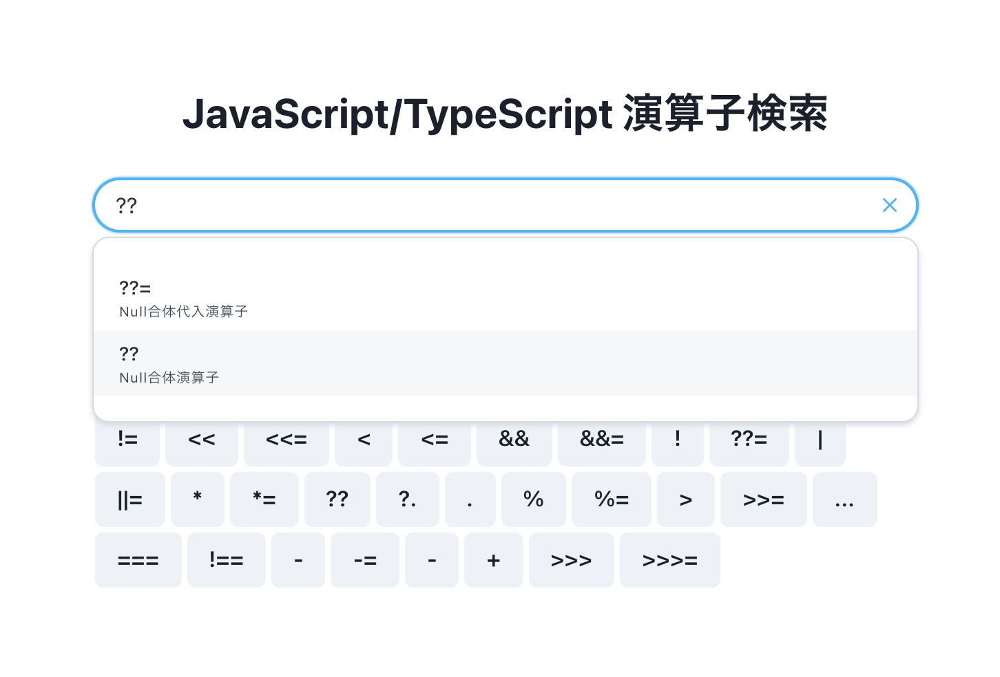
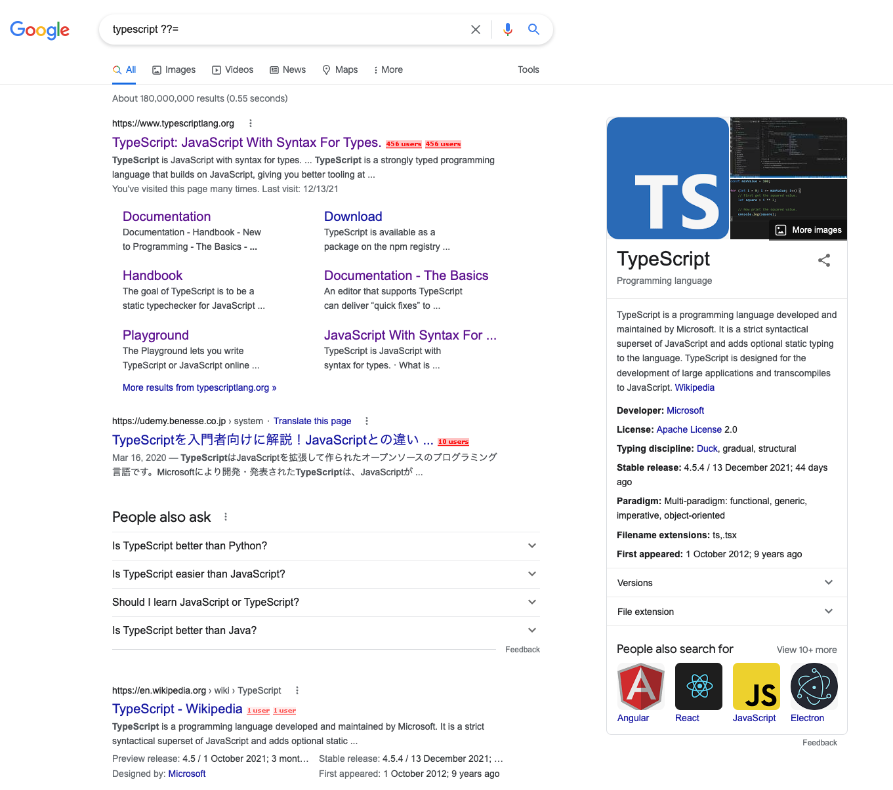
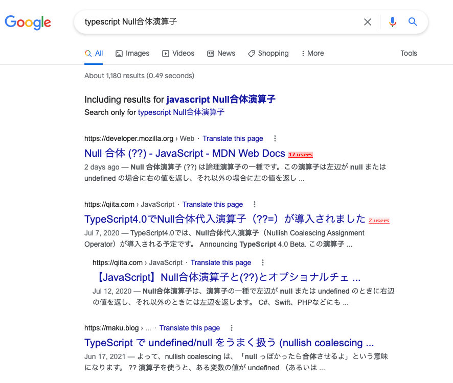

# JS TS Operator Search

検索性の低い、JS・TS の演算子の検索ツールです。

## 背景

### 演算子の検索性の低さ

[約物](https://ja.wikipedia.org/wiki/%E7%B4%84%E7%89%A9)は Google 検索ではクエリとして認識されません。演算子を検索するためには、演算子の名称（英語の検索結果が欲しければ英語で、日本語の検索結果が欲しければ日本語で）を覚えておかなければならないという問題点があります。

Null 合体演算子を Google 検索する

期待する Google 検索の結果

[Operator Lookup](https://www.joshwcomeau.com/operator-lookup/)は、この問題を解決する素晴らしいツールですが、「日本語でこの演算子はなんと呼ぶのだろう？」という問題の解決にはなりませんでした。そのため、Operator Lookup の日本語版として、本ツールを作成しました。

## コントリビューション

追加してほしい演算子やその他意見・感想があれば[Issue](https://github.com/uraway/js-ts-operator-search/issues)までお寄せください。
